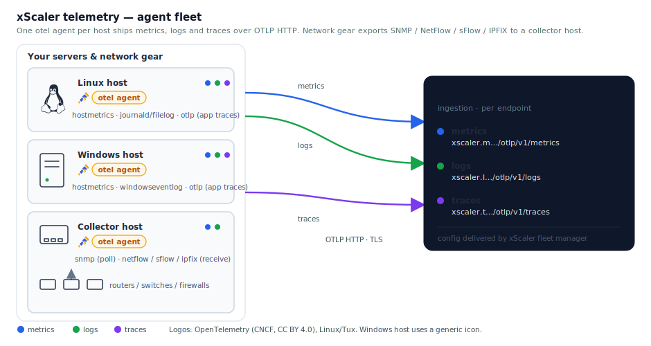

# Architecture

## Signal flow



> Logos: the **OpenTelemetry** mark (CNCF artwork, CC BY 4.0) badges each agent, and the
> **Linux/Tux** glyph (Simple Icons, CC0) marks the Linux host. The **Windows** host uses a
> generic server icon — Microsoft's trademark guidelines restrict embedding their logo without
> a license. Asset sources and how to change them: [docs/assets/README.md](assets/README.md).

Text version:

```
Linux host      ┐
  otel agent     │ hostmetrics ─ metrics ─┐
                 │ journald/filelog ─ logs ┤
                 │ otlp (local apps) ─ traces ┤
Windows host    ┤                            │
  otel agent     │ hostmetrics ─ metrics ─┤   ├──► xScaler ingestion (per endpoint)
                 │ windowseventlog ─ logs ┤   │      ├─ metrics  xscaler.m...  /otlp/v1/metrics
                 │ otlp (local apps) ─ traces┤  │      ├─ logs     xscaler.l...  /otlp/v1/logs
Collector host  ┤                            │   │      └─ traces   xscaler.t...  /otlp/v1/traces
  otel agent     │ snmp ─ metrics ─────────┤   │
                 │ netflow/sflow/ipfix ─ logs┘  ┘
```

Every request carries `Authorization: Bearer <key>` and `X-Scope-OrgID: <tenant>`. The xScaler
ingestion gateway validates the key, confirms the tenant matches, enforces plan limits, then
routes the request to the matching signal.

## Protocol per signal

| Signal  | Protocol the gateway accepts       | Exporter used                    |
|---------|------------------------------------|----------------------------------|
| Metrics | OTLP HTTP (`/otlp/v1/metrics`)      | `otlphttp` (`metrics_endpoint`)  |
| Logs    | OTLP HTTP (`/otlp/v1/logs`)         | `otlphttp` (`logs_endpoint`)     |
| Traces  | OTLP HTTP (`/otlp/v1/traces`)       | `otlphttp` (`traces_endpoint`)   |

All three signals ship over OTLP HTTP. The metrics endpoint also accepts Prometheus
remote-write at `/api/v1/push` if you prefer that protocol, but these roles use OTLP
end-to-end for a single, consistent exporter type.

## Host agents vs collector hosts

- **Host agents** (`otelcol_linux`, `otelcol_windows`) run on the machine being observed.
  One agent, one config, all three signals.
- **Collector hosts** (`otelcol_network_collector`) exist because switches/routers/firewalls
  can't run an agent. They **poll** devices over SNMP (pull → metrics) and **receive** flow
  exports the devices push to them (NetFlow/sFlow/IPFIX → logs). Run 1–N of them sized to
  your device count and flow volume; they're stateless, so scale horizontally.

A collector host should not also be in `linux_hosts` — both roles render the same
`/etc/otelcol-contrib/config.yaml` and would contend for the one service.

## Roles

| Role                        | Runs on           | Receivers                                  | Exports               |
|-----------------------------|-------------------|--------------------------------------------|-----------------------|
| `otelcol_common`            | all               | — (derives endpoints, validates inputs)    | —                     |
| `otelcol_linux`             | `linux_hosts`     | hostmetrics, journald, filelog, otlp       | metrics, logs, traces |
| `otelcol_windows`           | `windows_hosts`   | hostmetrics, windowseventlog, otlp         | metrics, logs, traces |
| `otelcol_network_collector` | `collector_hosts` | snmp, netflow (netflow/sflow/ipfix)        | metrics, logs         |

Disable any signal fleet-wide via the `signals` map in `group_vars/all.yml`.
